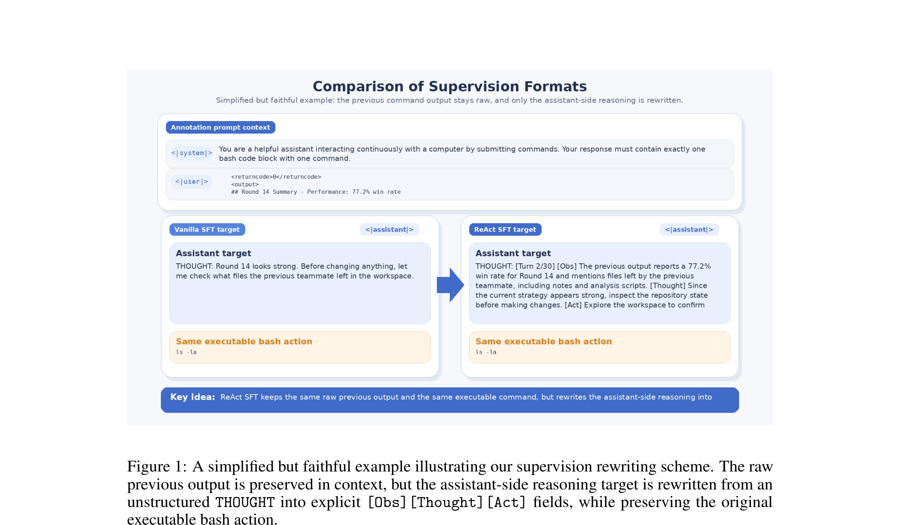

# Coding Agent SFT — Teaching Small Models to Code via BattleSnake

**Stanford CS224N (Winter 2026) Final Project**



## Overview

Can a 30B-parameter open-source model learn to code competitively by imitating frontier AI agents? This project studies **supervised fine-tuning (SFT)** of [Qwen3-Coder-30B](https://huggingface.co/Qwen/Qwen3-Coder-30B) on coding agent trajectories from the [CodeClash BattleSnake](https://codeclash.dev/) arena, where AI agents write BattleSnake game bots through multi-turn tool-use interactions.

We compare three SFT strategies:
- **Vanilla SFT** — train on raw agent trajectories
- **ReAct SFT** — rewrite trajectories into structured `[Observation][Thought][Action]` format using Claude/GPT as teachers
- **TQ-SFT (Trajectory-Quality SFT)** — weight training examples by trajectory quality scores

## Key Results

| Training Method | Win Rate vs Base Qwen3-Coder | Win Rate vs Claude Sonnet 4.5 |
|----------------|----:|----:|
| Base (no SFT) | 50.0% | — |
| Vanilla SFT | — | — |
| ReAct SFT | — | — |
| TQ-SFT | — | — |

*See the full report for detailed tournament results across all model matchups.*

## Pipeline

```
Phase 1: Data Collection
  └── Extract 8-agent BattleSnake trajectories from CodeClash tournaments
  └── Build base datasets (15-round complete games)

Phase 2: Data Annotation
  └── Phase 1 metadata: rule-based action tags + trajectory quality scores
  └── Phase 2 ReAct: rewrite trajectories via Claude/GPT into [Obs][Thought][Act]

Phase 3: Training (QLoRA on A100)
  └── Vanilla SFT (raw trajectories)
  └── ReAct SFT (structured trajectories)
  └── TQ-SFT (quality-weighted loss)

Phase 4: Evaluation
  └── Inference format tests
  └── 1000-game tournament evaluation
```

## Repository Structure

```
cs224n-coding-agent/
├── README.md                                          <- this file
├── code/
│   ├── README.md                                      <- detailed setup & run guide
│   ├── requirements.txt                               <- Python dependencies
│   ├── build_battlesnake_base_dataset_8agents_r15.py  <- data extraction
│   ├── annotate_phase1_metadata_top5.py               <- trajectory quality scoring
│   ├── annotate_phase2_claude_with_gpt5.py            <- ReAct rewriting via API
│   ├── train_flexi.py                                 <- vanilla & ReAct SFT training
│   ├── train_flexi_weighted.py                        <- TQ-SFT training
│   ├── test_flexi.py                                  <- inference format testing
│   ├── run_s1000_safe.py                              <- tournament runner
│   └── run_examples.sh                                <- example commands
├── figures/
│   └── figure1_cropped.png                            <- supervision format comparison
├── CS224N__Project_Final_Report_Template_20263__1_.pdf <- final report
├── coding_agent.pdf                                   <- project slides
└── metadata.yml
```

## Teacher Models Used

| Model | Role |
|-------|------|
| Claude Sonnet 4.5 | Trajectory source + ReAct rewriter |
| GPT-5 | Trajectory source + ReAct rewriter |
| GPT-5 Mini | Trajectory source |
| Grok Code (fast) | Trajectory source |
| o3 | Trajectory source |
| Claude Sonnet 4 | Trajectory source |
| Qwen3-Coder-Plus | Trajectory source |
| Gemini 2.5 Pro | Trajectory source |

## Quick Start

```bash
# Environment
python3.12 -m venv .venv && source .venv/bin/activate
pip install -r code/requirements.txt

# Build dataset
python3.12 code/build_battlesnake_base_dataset_8agents_r15.py \
  --root /path/to/codeclash_completed_full \
  --out-dir ./data --require-p2

# Train (vanilla SFT)
python3.12 -u code/train_flexi.py \
  --data ./data/base_qwen_battlesnake.jsonl \
  --output_dir ./outputs/vanilla_sft \
  --window_turns 6 --window_stride 3 \
  --max_seq_length 12000 --batch_size 1 \
  --gradient_accumulation_steps 8 --epochs 1 --lr 1e-5

# Evaluate
python3.12 code/run_s1000_safe.py config.yaml -s eval_run
```

See [`code/README.md`](code/README.md) for complete instructions.

## Tools & Infrastructure

| Component | Tool |
|-----------|------|
| Student model | Qwen3-Coder-30B |
| Training | QLoRA via Unsloth + TRL |
| Compute | A100 GPU |
| Arena | CodeClash BattleSnake |
| Teacher APIs | Anthropic (Claude), OpenAI (GPT-5/o3), Google (Gemini) |

## Report & Poster

- [Final Report (PDF)](CS224N__Project_Final_Report_Template_20263__1_.pdf)
- [Slides (PDF)](coding_agent.pdf)

## License

Academic project — Stanford CS224N Winter 2026.

## Contact

para2046 — `para2046 [at] stanford [dot] edu`
