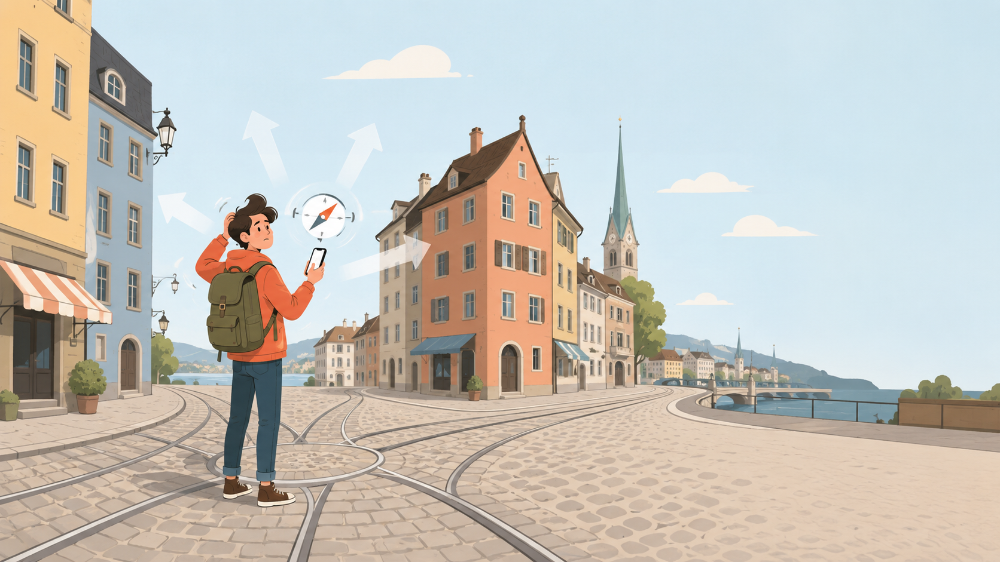
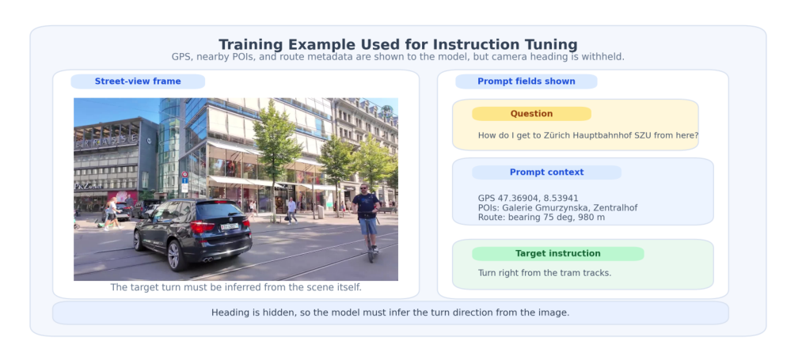

# NavLM v2 — Visual Walking Directions Without a Compass

**Stanford CS231N (Spring 2026) Final Project**



> Can a vision-language model issue the correct next walking action from a single street photo — without being given a compass heading?

## Overview

NavLM is an end-to-end pipeline for training a **compass-free, landmark-free vision-language navigation model** on Zurich walking-tour videos. A LoRA-fine-tuned [Qwen 2.5 VL 7B](https://huggingface.co/Qwen/Qwen2.5-VL-7B-Instruct) takes a single street-level photo + a destination name and emits one of four egocentric actions:

- `continue ahead`
- `turn left`
- `turn right`
- `turn around`

The key insight: in many urban scenes, a model can recover enough orientation from **visual cues** (church spires, river geometry, tram tracks, storefronts, landmark visibility) to choose the correct action — even when numeric heading is withheld.

## Training Example



*GPS, nearby POIs, and route metadata are shown to the model, but camera heading is withheld. The model must infer the turn direction from the scene itself.*

## Results

LoRA fine-tuning on teacher-labeled (Gemini Pro 2.5) navigation examples yields large improvements over zero-shot baselines:

| Variant | Zero-shot | Best LoRA | Absolute Lift |
|---------|----------:|----------:|--------------:|
| **given** (heading provided) | 49.7% | **98.8%** (r=8, e=5) | +49.1 pp |
| **derived** (heading hidden, inferred via CoT) | 30.2% | **67.2%** (r=16, e=3) | +37.0 pp |
| **implicit** (heading hidden, no numeric value) | 25.1% | **62.2%** (r=16, e=5) | +37.1 pp |

The `given` variant demonstrates the model can nearly perfectly follow routes when heading is available. The `derived` and `implicit` variants show that **significant navigation capability persists even without compass information**.

## Pipeline Architecture

The system is built in **10 stages**, creating self-supervised training data from raw walking-tour videos:

```
Stage 1: Video -> Frames          (7 Zurich walking-tour videos, ~35K frames)
Stage 2: StreetView + DINOv2      (4,400 SV crops, visual matching)
Stage 3: OSM Walking Graph        (17,996 nodes / 48,218 edges)
Stage 4: POI Vocabulary           (21 curated Zurich attractions)
Stage 5: 3-Way GPS/VLM Join       (1,219 matched frames)
Stage 6: Heading + Routes         (3,657 frame-destination pairs)
Stage 7: Teacher Annotation       (Gemini Pro 2.5 labels)
Stage 8: SFT Conversion           (3 variants x train/val/test)
Stage 9: LoRA Fine-Tuning         (Modal A100-80GB, 9 trainings)
Stage 10: Evaluation              (Modal A100-40GB)
```

## Repository Structure

```
cs231n-navlm/
├── README.md                          <- this file
├── code_submission/
│   ├── README.md                      <- detailed pipeline docs
│   ├── config.py                      <- data paths (driven by NAVLM_DATA env var)
│   ├── requirements.txt               <- Python dependencies
│   ├── _smoketest.py                  <- quick sanity check
│   ├── src/                           <- all pipeline stages
│   │   ├── download_videos.py         <- Stage 1
│   │   ├── extract_frames.py
│   │   ├── streetview.py              <- Stage 2
│   │   ├── dinov2_match.py
│   │   ├── gps_recovery.py
│   │   ├── build_walking_graph.py     <- Stage 3
│   │   ├── road_snap.py
│   │   ├── a2_annotate.py             <- Stage 7 (Gemini teacher)
│   │   ├── a2_train_modal.py          <- Stage 9 (LoRA SFT)
│   │   ├── a2_eval_modal.py           <- Stage 10 (evaluation)
│   │   ├── a2_score.py                <- PASS scoring
│   │   └── ...                        <- see code_submission/README.md
│   └── viz/                           <- interactive HTML visualizations
├── figures/                           <- project figures
├── report/
│   ├── navlm_v2_report.tex            <- CVPR-format LaTeX report
│   ├── navlm_v2_report.pdf            <- compiled report
│   └── navlm_refs.bib                 <- bibliography
├── CS231n_final_report__2_.pdf        <- submitted final report
├── navlm.pdf                          <- project poster
└── metadata.yml
```

## Key Technical Components

- **DINOv2-Large** for visual place matching between video frames and Street View panoramas
- **HMM map-matching** to snap noisy GPS tracks onto the OSM walking graph
- **Gemini Pro 2.5** as a teacher model for generating navigation instruction labels
- **Qwen 2.5 VL 7B + LoRA** as the student model (trained on Modal A100-80GB)
- **Three prompt variants** to isolate the effect of heading information

## Quick Start

```bash
# Environment setup
conda create -n navlm python=3.10 -y && conda activate navlm
pip install -r code_submission/requirements.txt

# Set data root
export NAVLM_DATA=/path/to/data

# Modal setup (for training/eval)
modal token new

# Run the pipeline (see code_submission/README.md for full details)
python -m src.download_videos
python -m src.extract_frames
# ... (stages 2-10)
```

See [`code_submission/README.md`](code_submission/README.md) for complete pipeline instructions, wall-times, and cost estimates.

## Tools & Infrastructure

| Component | Tool |
|-----------|------|
| Base VLM | Qwen 2.5 VL 7B Instruct |
| Teacher model | Gemini Pro 2.5 |
| Visual features | DINOv2-Large |
| Street data | Google Street View Static API |
| Map graph | OpenStreetMap via osmnx |
| Training infra | Modal (A100-80GB) |
| Development | Claude Code (Opus 4.7/4.8) |

## Report & Poster

- [Final Report (PDF)](CS231n_final_report__2_.pdf)
- [Project Poster (PDF)](navlm.pdf)
- [LaTeX Source](report/navlm_v2_report.tex)

## License

Academic project — Stanford CS231N Spring 2026.

## Contact

para2046 — `para2046 [at] stanford [dot] edu`
